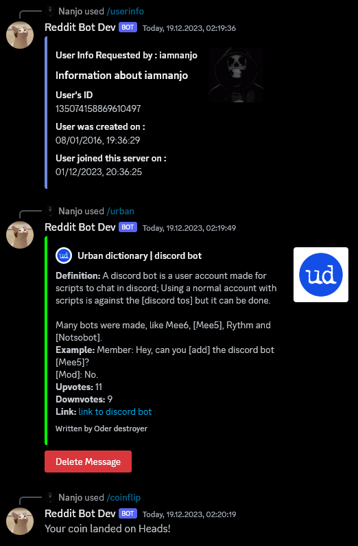
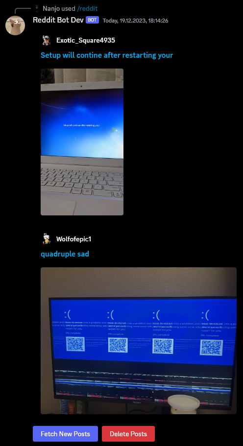

# Discord Bot

[Invite link](https://discord.com/api/oauth2/authorize?client_id=838342857001533471&permissions=3155968&scope=bot)

This Discord bot has very basic features, such as bulk deletion of messages, getting information about users, fetching images from reddit and definitions from urban dictionary. The bot is made using [discord.js](https://discord.js.org/).

For development I use [Bun](https://bun.sh/) for faster package installs, support for executing TypeScript and better performance. I also use [PM2](https://pm2.keymetrics.io/) for the production environment to make sure the bot stays online at all times.

## Screenshots

